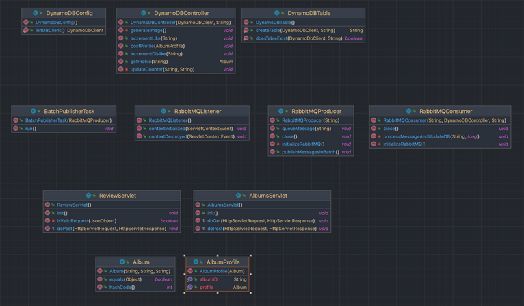
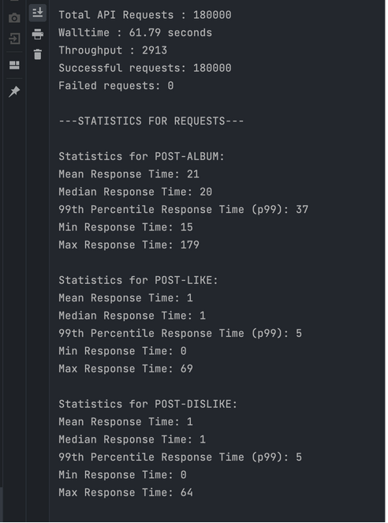
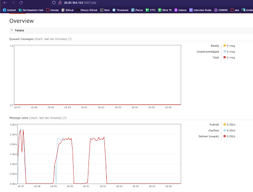

# **Distributed Album Store Service**

## **Overview**

This project demonstrates the implementation of a distributed album store
service, featuring server-client interaction, database management with DynamoDB,
asynchronous processing using RabbitMQ, and load testing for performance
optimization. The application is designed to handle high throughput and
efficiently manage album data across multiple servers with load balancing.

## **Code Structure**

The server and client code are hosted within the same repository to demonstrate
the tight integration of components in this project. However, despite being part
of the same repository, the client and server are independent entities with
distinct build processes, each reading from their respective `pom.xml` files.
This separation of build scripts ensures that while they coexist within the same
repository, the client and server do not rely on each other’s build process,
providing flexibility and reducing coupling in terms of code dependency.

---

## **Project Structure**

- **`client/`**  
  Contains the client-side code responsible for sending requests to the album
  store server. The client communicates with the server to post album data,
  including images, and retrieves responses. The client also logs the
  performance results.
- **`server/`**  
  Hosts the album store server code, which includes two different
  implementations:
  1. **Java EE Servlet-Based Server:** Integrates with AWS DynamoDB and RabbitMQ
     for handling album data and asynchronous messaging for tasks such as
     "likes" and "dislikes."
  2. **Go Gin Server:** Provides a lightweight alternative server for
     performance comparison with the Java-based servlet server. Does not include
     a data store or distributed message queue.
- **`client-results/`**  
  Contains the results generated when running the client code against the hosted
  server. These results track throughput, response times, and success/failure
  rates under various load conditions.
- **`nmtb.png`**  
  A sample image used for testing the server’s response throughput. It is an
  album cover image posted to the server to simulate large data uploads, which
  are more challenging than text-based requests.

---

## **Components and How They Work**

### **Album Store Server**

Server UML with Java EE Servlets:

The album store server is designed to handle high volumes of client requests
while efficiently managing data storage and background processing. It consists
of:

- **DynamoDB Integration:**
  - The server uses AWS DynamoDB to store album data, including artist details
    and album covers.
  - DynamoDB offers low-latency access to data, ensuring the server can handle
    large amounts of requests without becoming a bottleneck.
  - The data schema includes fields for a unique album ID, JSON-formatted artist
    details, and a 100-byte placeholder for album images.
- **RabbitMQ Integration:**
  - RabbitMQ is used to manage asynchronous tasks such as processing "likes" and
    "dislikes" on albums.
  - This allows the server to quickly respond to the client while handling
    background operations asynchronously, thus improving client-side performance
    and reducing server load.
- **Java EE Servlets:**
  - The primary server implementation uses Java EE servlets to handle incoming
    requests.
  - Servlets interact with DynamoDB for data storage and RabbitMQ for background
    processing.
  - The server is hosted on an AWS EC2 instance and configured with an
    application load balancer to distribute client requests efficiently.
- **Go Gin Server:**
  - A secondary server implemented using Go and the Gin framework is included to
    compare performance with the Java servlet-based server.
  - This lightweight alternative offers insights into how different server
    frameworks handle the same client workload.

### **2\. Client**

The client is responsible for posting album data, including images, to the
server and retrieving responses. It is designed to simulate high traffic to test
the scalability and performance of the server. Key functionalities include:

- **Simulating Client Requests:**
  - The client sends requests to the server to post album data, including
    JSON-encoded artist information and images (such as `nmtb.png`).
  - Each request is logged, and the performance (e.g., response time) is
    recorded in `response_data.csv`.
- **Multi-threading:**
  - The client can generate multiple concurrent requests to test the server’s
    ability to handle high traffic loads.
  - This allows for stress testing the server under different conditions and
    thread configurations (e.g., 10/20/2, 10/30/2 setups, indicating different
    initial load tests and load test groups with a 2 second delay).

### **3\. Performance Testing**

Performance testing is a critical part of this project. The results from various
tests are stored in `client-results/`, allowing for easy comparison between
different server setups. The tests focus on:

- **Throughput:**  
  Measured by the number of requests the server can handle per second under
  different client loads.
- **Response Times:**  
  Collected in `response_data.csv`, these times indicate how quickly the server
  responds to client requests under various load conditions.
- **Success and Failure Rates:**  
  The system logs whether each request was successful or failed due to server
  overload, providing insight into the server’s capacity and reliability.

Sample throughput results when running client:

RabbitMQ load, spikes observed but controlled due to batch publishing:

---

## **How to Run**

### **Running the Java Servlet-Based Server**

1. Navigate to the `server/` directory.
2. Run the following Maven commands:

`mvn clean`  
`mvn install`

Start the server by deploying the `AlbumsServlet.java` on tomcat

### **Running the Go Gin Server**

1. Navigate to the server/ directory.
2. Compile and start the Go server using the Go build tools:

`go build ./gin-server`

The ports for both java and go servers are 8080:
`http://localhost:8080/AlbumStore`

### **Running the Client**

1. Navigate to the `client/` directory.
2. Run the following Maven commands:  
   bash

`mvn clean`  
`mvn install`

Execute the client to send requests to the server. The results will be logged in
`client-results/` and `response_data.csv`.

Make sure that the edit configurations in the client points to where the server
is hosted (if locally or on aws)

## **Conclusion**

This project demonstrates a scalable distributed album store service, designed
to handle high client request volumes with minimal latency. By utilizing
DynamoDB for fast data access, RabbitMQ for asynchronous background processing,
and load balancing for efficient request distribution, the system achieves high
throughput and reliable performance. The inclusion of both Java servlet and Go
Gin server implementations provides insights into the performance trade-offs
between different server frameworks.
